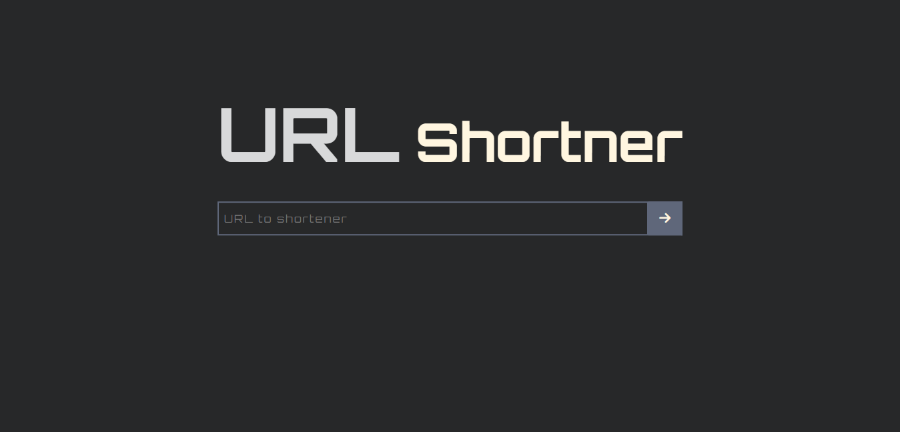

# URL Shortener Project

This project is a URL shortener application that integrates the Spoo.me API to shorten URLs for users. The application includes form validation and one-click copy functionality for ease of use.

## Table of contents
- [Features](#features)
- [Screenshot](#screenshot)
- [Links](#links)
- [Built with](#built-with)

## Features

- Integration with the Spoo.me API for URL shortening.
- Form validation to ensure accurate input.
- One-click copy functionality for easy sharing of shortened links.
- Popups for error and copying the shortened links.

## Screenshot

## Links

- Live Site URL: https://mo7aziz.github.io/URL_shortening/](https://mo7aziz.github.io/URL_shortening/)

## Built with

- HTML
- CSS
- JAVASCRIPT
- [Spoo.me API](https://spoo.me/api)
- [Font Awsome 6](https://fontawesome.com/) For icons
- [sweetalert js](https://sweetalert.js.org/) For Popups
